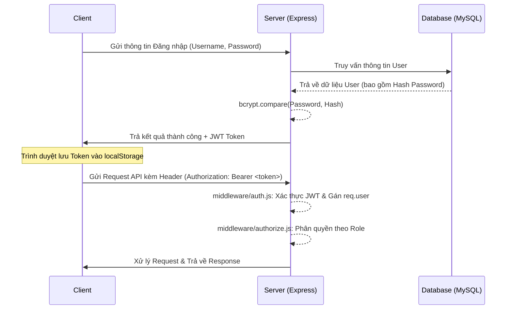

# ⚙️ Backend - Node.js + Express

> Máy chủ cung cấp API RESTful cho Hệ thống Quản lý Đề tài và Khóa luận.

[](https://nodejs.org/)
[](https://expressjs.com/)
[](https://www.mysql.com/)

---

## 📑 Mục lục

- [Cấu trúc thư mục](#-cấu-trúc-thư-mục)
- [Yêu cầu hệ thống](#-yêu-cầu-hệ-thống)
- [Hướng dẫn cài đặt & Chạy dự án](#-hướng-dẫn-cài-đặt--chạy-dự-án)
- [Danh sách API cốt lõi](#-danh-sách-api-cốt-lõi)
- [Kiến trúc & Luồng hoạt động](#-kiến-trúc--luồng-hoạt-động)

---

## 📁 Cấu trúc thư mục

```text
server/
├── config/
│   └── db.js                  # Cấu hình kết nối cơ sở dữ liệu MySQL (Connection Pool)
├── controllers/               # Xử lý logic nghiệp vụ cho từng endpoint API
│   ├── authController.js      # Xác thực (Đăng nhập, Profile, Đổi mật khẩu)
│   ├── userController.js      # Quản lý tài khoản CRUD (Dành cho Admin)
│   ├── topicController.js     # Quản lý đề tài (CRUD, Duyệt đề tài)
│   ├── wishController.js      # Xử lý nguyện vọng (Đăng ký, Duyệt/Từ chối)
│   ├── milestoneController.js # Quản lý các mốc tiến độ thực hiện
│   ├── progressController.js  # Xử lý nộp và đánh giá tiến độ của sinh viên
│   ├── gradeController.js     # Chấm điểm dựa trên rubric cấu hình sẵn
│   ├── dashboardController.js # Tính toán thống kê và trích xuất Excel
│   ├── notificationController.js # Phân phối và hiển thị thông báo
│   └── auditLogController.js  # Truy xuất nhật ký hệ thống (Chỉ Admin)
├── middleware/                # Các middleware dùng chung để kiểm soát requests
│   ├── auth.js                # Giải mã và xác thực JWT Token
│   ├── authorize.js           # Phân quyền truy cập dựa trên Role (Admin/GV/SV)
│   ├── auditLog.js            # Tự động ghi lại các hành động có thay đổi dữ liệu
│   ├── upload.js              # Xử lý upload file (sử dụng Multer)
│   └── errorHandler.js        # Bắt và xử lý lỗi tập trung toàn ứng dụng
├── routes/                    # Định nghĩa cấu trúc định tuyến (API Routes)
├── utils/
│   └── notificationService.js # Các dịch vụ nền (Cron Jobs: nhắc deadline)
├── database/
│   └── init.sql               # Script khởi tạo cấu trúc cơ sở dữ liệu SQL
├── .env                       # Chứa các biến môi trường nhạy cảm (Config)
├── seed.js                    # Script khởi tạo dữ liệu mẫu (Seeding)
├── server.js                  # Entry point chính của Node.js / Express
└── package.json               # Khai báo libraries và scripts
```

---

## ⚙️ Yêu cầu hệ thống

- **Node.js**: Phiên bản 16.x trở lên
- **MySQL**: Phiên bản 8.x
- **npm** hoặc **yarn**

---

## 🚀 Hướng dẫn cài đặt & Chạy dự án

1. **Khởi tạo cơ sở dữ liệu MySQL:**
   Sử dụng công cụ quản trị MySQL hoặc CLI để chạy script tạo bảng:
   ```bash
   mysql -u root -p < database/init.sql
   ```

2. **Cấu hình biến môi trường:**
   - Tạo file `.env` ở thư mục gốc của server (nếu chưa có).
   - Thiết lập các thông số cơ sở dữ liệu, đặc biệt chú ý `DB_PASSWORD`.
   ```env
   # Ví dụ cấu hình trong file .env
   DB_HOST=localhost
   DB_USER=root
   DB_PASSWORD=your_password
   DB_NAME=topic_management
   JWT_SECRET=your_secret_key
   PORT=5000
   ```

3. **Cài đặt các thư viện cần thiết & Tạo dữ liệu mẫu:**
   ```bash
   npm install
   node seed.js
   ```

4. **Khởi động API Server:**
   Chạy server ở chế độ Production:
   ```bash
   npm start
   ```
   Hoặc chạy ở chế độ Development (tự động reload khi sửa code với nodemon):
   ```bash
   npm run dev
   ```
   > 📌 Mặc định API Server sẽ chạy tại: [http://localhost:5000](http://localhost:5000)

---

## 🔌 Danh sách API cốt lõi

| Prefix / Định tuyến API | Controller Phụ Trách | Chức Năng Chính |
|-------------------------|----------------------|-----------------|
| `/api/auth` | `authController` | Đăng nhập lấy token, xem profile, đổi mật khẩu. |
| `/api/users` | `userController` | Quản trị tài khoản (CRUD - Chỉ dành cho Admin). |
| `/api/topics` | `topicController` | Quản lý Đề tài (Thêm mới, sửa, duyệt đề tài). |
| `/api/wishes` | `wishController` | Quản lý đăng ký nguyện vọng, duyệt/từ chối sinh viên. |
| `/api/milestones` | `milestoneController` | Quản lý vòng đời và các mốc báo cáo tiến độ. |
| `/api/progress` | `progressController` | Sinh viên nộp báo cáo, giảng viên nhận xét và đánh giá. |
| `/api/grades` | `gradeController` | Chấm điểm đồ án/khóa luận bằng thang điểm Rubric. |
| `/api/dashboard` | `dashboardController` | Tổng hợp số liệu thống kê chung, kết xuất báo cáo Excel. |
| `/api/notifications` | `notificationController` | Lấy danh sách thông báo và đánh dấu các mục đã đọc. |
| `/api/audit-logs` | `auditLogController` | Xem lịch sử sự kiện bảo mật và thao tác thay đổi dữ liệu. |

---

## 🏗 Kiến trúc & Luồng hoạt động

### 1. Luồng Xác thực (Authentication Flow)



### 2. Luồng Xử lý Nghiệp vụ Chính

1. **Khởi tạo và Phê duyệt Đề tài:** 
   - Giảng viên đề nghị đề tài nghiên cứu (Trạng thái: `Draft`).
   - Admin / Trưởng bộ môn rà soát và phê duyệt đưa vào sử dụng (Trạng thái: `Approved`).
2. **Đăng ký Nguyện vọng:** 
   - Khi đợt đăng ký mở, Sinh viên bắt đầu đăng ký nguyện vọng với các đề tài đã duyệt (Tối đa 3 nguyện vọng trên 1 sinh viên).
3. **Phân bổ và Chốt danh sách:** 
   - Giảng viên hướng dẫn xem xét và duyệt nguyện vọng của sinh viên.
   - Khi sinh viên được chấp nhận vào 1 đề tài, hệ thống tự động loại các nguyện vọng còn lại và chốt danh sách phân công.
4. **Theo dõi Báo cáo Tiến độ:** 
   - Sinh viên nộp tài liệu/báo cáo theo từng **mốc thời gian tiến độ** đã thiết lập trước.
   - Giảng viên phản hồi, đánh giá và nhận xét tài liệu nộp.
5. **Chấm điểm Rubric Tổng kết:** 
   - Hội đồng hoặc Giảng viên chấm điểm chi tiết từng phần dựa trên cấu trúc Rubric (đã thiết lập trọng số rõ ràng cho từng tiêu chí).
6. **Thống kê Báo cáo (Dashboard):** 
   - Toàn bộ kết quả từ số lượng đề tài, tiến độ sinh viên, bảng điểm được trực quan hóa thành biểu đồ trên Dashboard để theo dõi nhanh hoặc xuất Excel.


